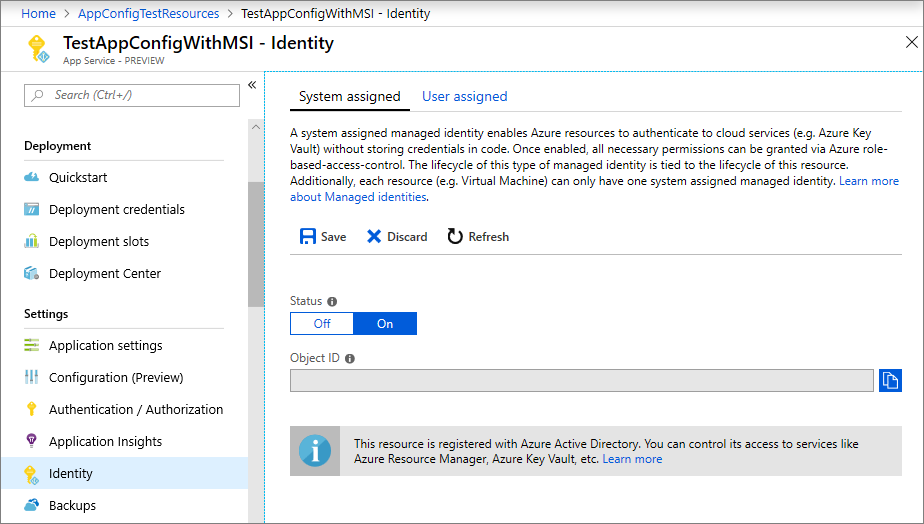
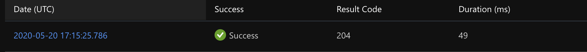
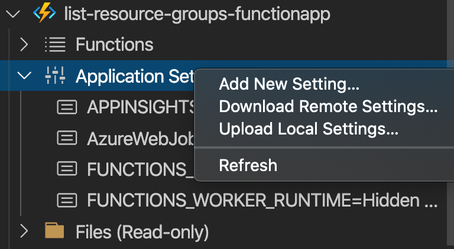

# Getting the list of Resource Groups using Azure Functions

Automation using the Azure Function is one of the primary use cases of Azure Functions. Your Azure Functions app can be either a simple timer-based application to do cleanup or become an extensive Azure Event Grid based listener to do advanced data auditing and event-driven administration and automation. Azure Functions supports multiple trigger-types such as HTTP trigger, Timer trigger and Azure Event Grid trigger, which can help in administration and automation scenarios for Azure resources.

## Pre-requisites

Here are some of the prerequisites to get this sample work for you.

### 1. Creating a new Azure Function App in VS Code

For creating an Azure Function App in VSCode, please go through the [Microsoft Docs tutorial on creating your first Azure Function using Visual Studio Code](https://docs.microsoft.com/azure/azure-functions/functions-create-first-function-vs-code?pivots=programming-language-python). In the code snippet along with the sample, we name the function `GetListOfResourceGroups`, with the HTTP trigger. In the sample below, we will update the `function.json`.

### 2. Updating the Requirements.txt to resolve the dependencies

One you generate a new function app, the `requirements.txt` should have the following dependencies added to it :

```python
azure-functions
azure-mgmt-compute
azure-mgmt-resource
azure-identity
azure-cli-core
```

### 3. Setting up the application settings

Setting up `local.settings.json` would help you pass in the subscription Id

```json
{
"IsEncrypted": false,
"Values": {
"AzureWebJobsStorage": "DefaultEndpointsProtocol=https;AccountName=foobar;AccountKey=******==;EndpointSuffix=core.windows.net",
"FUNCTIONS_WORKER_RUNTIME": "python",
"AZURE_SUBSCRIPTION_ID": "8e03%%%%-%%%%-%%%%-%%%%-%%%%%%%%c15b"}
}
```

### 4. Managed Service Identity for the Azure Function App

You need to toggle the system assigned identity flag to “On” here to get the app registered to interact with Azure resources using this managed identity .

[!NOTE]
Please go through the [Managed identities](https://docs.microsoft.com/azure/app-service/overview-managed-identity?tabs=python#add-a-system-assigned-identity) blog for more details on how to set up system identities and find more details.



Once you setup the application’s system identity, setup the role assignments of the service principle to give the app access to the subscription information. More details on assigning role to the app can be found in the documentation for [assigning a role to the application](https://docs.microsoft.com/azure/active-directory/develop/howto-create-service-principal-portal#assign-a-role-to-the-application).

## List Resource Groups using Azure Functions and Azure Python SDK

The following application uses the above set managed identity to talk with Azure to get the resource groups list. We create an HTTP Trigger based function, with route setup and return a JSON list of resource groups information.

Here is the `function.json`:

```json
{ "scriptFile": "__init__.py",
  "bindings": [{
      "authLevel": "anonymous",
      "type": "httpTrigger",
      "direction": "in",
      "name": "req",
      "methods": ["get"],
      "route": "resourcegroups"
    },{
      "type": "http",
      "direction": "out",
      "name": "$return"
}]}
```

### Thinking `async` when doing IO operations

As described in the [best practices guide for Azure Functions](https://docs.microsoft.com/azure/azure-functions/functions-best-practices#use-async-code-but-avoid-blocking-calls), making your functions asynchronous is one of the keep your code performant for long IO calls.  In the following sample, we use the `async` and `await` to get the resource group lists in an asynchronous fashion.

```python
async def main(req: func.HttpRequest) -> func.HttpResponse:
    """
    The main entry point to the function.
    """

    if "MSI_ENDPOINT" in os.environ:
        credentials = MSIAuthentication()
    else:
        credentials, *_ = get_azure_cli_credentials()

    subscription_id = os.environ.get(
        'AZURE_SUBSCRIPTION_ID', '11111111-1111-1111-1111-111111111111')

    list_of_rgs = await list_rgs(credentials, subscription_id)

    return func.HttpResponse(list_of_rgs, mimetype="application/json")
```

It is a good practice to modularize your code and separate out the operations into its own modules. This example puts all the resource groups related operation in its own module.

```python
def process_rg_instance(group):
    """
    Get the relevant pieces of information from a ResourceGroup instance.
    """
    return {
        "Name": group.name,
        "Id": group.id,
        "Location": group.location,
        "Tags": group.tags,
        "Properties": group.properties.provisioning_state if group.properties and group.properties.provisioning_state else None
    }


async def list_rgs(credentials, subscription_id):
    """
    Get list of resource groups for the subscription id passed.
    """
    list_of_resource_groups = []

    with ResourceManagementClient(credentials, subscription_id) as rg_client:
        try:
            for i in rg_client.resource_groups.list():
                list_of_resource_groups.append(process_rg_instance(i))

        except Exception as e:
            logging.error("encountered: {0}".format(str(e)))

    return json.dumps(list_of_resource_groups)
```

### Testing locally

To test locally, start the debug mode and test the function using the HTTP endpoint exposed after the host and the worker load up the function.

```log
Http Functions:
GetListOfResourceGroups: [GET] http://localhost:7071/api/resourcegroups
```

### Testing in Azure

You can publish the function app directly from VSCode using the “Publish to Azure option” in the Azure extension. For more information, please refer the guide to [publish the project to Azure using Visual Studio Code](https://docs.microsoft.com/azure/azure-functions/functions-create-first-function-vs-code?pivots=programming-language-python#publish-the-project-to-azure).

You can use a tool like Postman to see the API in action locally, and on Azure. Running locally will help you to verify the credentials, configuration and business logic. If you find any issue, please check the Troubleshooting section below to help you solve the known issues.

## Conclusion

This sample helps you setup your app to work with Azure resources using the Managed Service Identity (MSI) and get a list of resource groups in your subscription. This would help you get started with Azure functions to be used for Azure resource administration and automation scenario.

## Troubleshooting

Here are some of the issues you might hit while running the sample:

### 1. You need to install 'azure-cli-core' to load CLI credentials

Check the `requirements.txt` file to make sure `azure-cli-core` is installed.

```python
5/20/2020 6:10:33 AM] Executed 'Functions.DeleteResourcesTimerFunction' (Failed, Id=c49aced0-c73a-45e0-9302-dc686cef5742)
[5/20/2020 6:10:33 AM] System.Private.CoreLib: Exception while executing function: Functions.DeleteResourcesTimerFunction. System.Private.CoreLib: Result: Failure
[5/20/2020 6:10:33 AM] Exception: ImportError: You need to install 'azure-cli-core' to load CLI credentials
[5/20/2020 6:10:33 AM] Stack:   File "/usr/local/Cellar/azure-functions-core-tools@3/3.0.2534/workers/python/3.7/OSX/X64/azure_functions_worker/dispatcher.py", line 312, in _handle__invocation_request
[5/20/2020 6:10:33 AM]     call_result = await fi.func(**args)
[5/20/2020 6:10:33 AM]   File "/Users/varadmeru/work/microsoft/LinuxGARelated/cleanup-service-v2/DeleteResourcesTimerFunction/main.py", line 21, in main
[5/20/2020 6:10:33 AM]     await asyncio.gather(cleanup())
[5/20/2020 6:10:33 AM]   File "/Users/varadmeru/work/microsoft/LinuxGARelated/cleanup-service-v2/DeleteResourcesTimerFunction/cleanup.py", line 122, in cleanup
[5/20/2020 6:10:33 AM]     credentials, *_ = get_azure_cli_credentials()
[5/20/2020 6:10:33 AM]   File "/Users/varadmeru/work/microsoft/LinuxGARelated/cleanup-service-v2/.venv/lib/python3.7/site-packages/azure/common/credentials.py", line 97, in get_azure_cli_credentials
[5/20/2020 6:10:33 AM]     profile = get_cli_profile()
[5/20/2020 6:10:33 AM]   File "/Users/varadmeru/work/microsoft/LinuxGARelated/cleanup-service-v2/.venv/lib/python3.7/site-packages/azure/common/credentials.py", line 30, in get_cli_profile
[5/20/2020 6:10:33 AM]     raise ImportError("You need to install 'azure-cli-core' to load CLI credentials")
```

### 2. ‘DefaultAzureCredential' object has no attribute 'signed_session'

If you are using the new DefaultAzureCredential - [Authentication and the Azure SDK | Azure SDKs](https://azure.github.io/azure-sdk/posts/2020-02-25/defaultazurecredentials.html), you could see the following error showing up in the functions logs, even if your function doesn’t throw an Internal Server Error.



```python
encountered: 'DefaultAzureCredential' object has no attribute 'signed_session'
```

Please use MSIAuthentication for the time being.

### 3. Seeing 404s when running code

1. Seeing `FileNotFoundError: [Errno 2] No such file or directory: '/home/.azure/azureProfile.json'` in the invocation logs.

    The stack trace looks like the following:

    ```python
    Result: Failure Exception: FileNotFoundError: [Errno 2] No such file or directory: '/home/.azure/azureProfile.json'
    Stack:
    File "/azure-functions-host/workers/python/3.7/LINUX/X64/azure_functions_worker/dispatcher.py", line 311, in _handle__invocation_request call_result = await fi.func(**args)
    File "/home/site/wwwroot/GetListOfResourceGroups/__init__.py", line 20, in main credentials, *_ = get_azure_cli_credentials()
    File "/home/site/wwwroot/.python_packages/lib/site-packages/azure/common/credentials.py", line 97, in get_azure_cli_credentials profile = get_cli_profile()
    File "/home/site/wwwroot/.python_packages/lib/site-packages/azure/common/credentials.py", line 34, in get_cli_profile ACCOUNT.load(os.path.join(azure_folder, 'azureProfile.json'))
    File "/home/site/wwwroot/.python_packages/lib/site-packages/azure/cli/core/_session.py", line 61, in load self.save()
    File "/home/site/wwwroot/.python_packages/lib/site-packages/azure/cli/core/_session.py", line 65, in save with codecs_open(self.filename, 'w', encoding=self._encoding) as f:
    File "/usr/local/lib/python3.7/codecs.py", line 904, in open file = builtins.open(filename, mode, buffering)
    ```

    This is due to the system assigned service principle not enabled yet. Check the perquisites.

2. Authorization failed message due to role assignment not present - please check pre-requisite #4 for the fix. Also confirm if the local settings are correctly reflecting in the portal (check the troubleshooting bullet below).

    ```python
    encountered: Azure Error: AuthorizationFailed Message: The client 'a7ad%%%%-%%%%-%%%%-%%%%-%%%%%%%%8c13' with object id 'a7ad%%%%-%%%%-%%%%-%%%%-%%%%%%%%8c13' does not have authorization to perform action 'Microsoft.Resources/subscriptions/resourcegroups/read' over scope '/subscriptions/8e03%%%%-%%%%-%%%%-%%%%-%%%%%%%%c15b' or the scope is invalid. If access was recently granted, please refresh your credentials.
    ```

3. Subscription not found - In our code, we fetch the subscription from the environment variable

    ```python
        subscription_id = os.environ.get(
            'AZURE_SUBSCRIPTION_ID', '11111111-1111-1111-1111-111111111111')
    ```

    You could Make sure your local setting are updated

    
